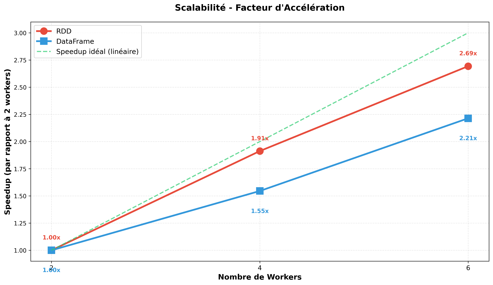
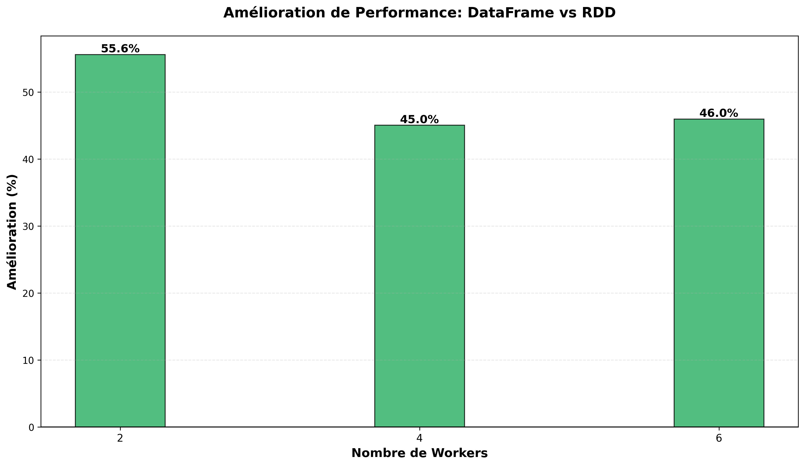
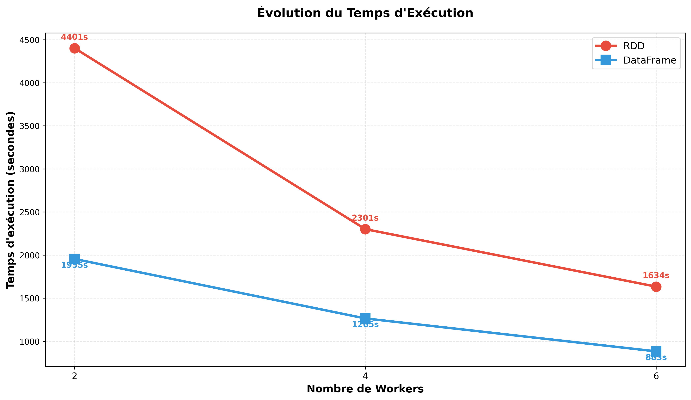

# PageRank - Analyse de Performance PySpark

**Projet:** page-rank-479014  
**Dataset:** DBpedia WikiLinks (180M+ triples, 11GB non compressé)  
**Date des tests:** 6 décembre 2025  
**Région GCP:** europe-west1

---

## 📊 Résumé Exécutif

Ce document présente les résultats des tests de performance de l'algorithme PageRank sur un dataset complet de liens Wikipedia, exécuté sur Google Cloud Dataproc avec différentes configurations de workers.

### Configurations Testées

| Configuration | Master   | Workers  | Total vCPU | RAM Totale | Type Machine  |
|---------------|----------|----------|------------|------------|---------------|
| **2 workers** | 1×4 vCPU | 2×4 vCPU | 12 vCPU    | ~48 GB     | e2-standard-4 |
| **4 workers** | 1×4 vCPU | 4×4 vCPU | 20 vCPU    | ~80 GB     | e2-standard-4 |
| **6 workers** | 1×4 vCPU | 6×4 vCPU | 28 vCPU    | ~112 GB    | e2-standard-4 |

### Paramètres de l'Algorithme

- **Itérations:** 10
- **Damping factor:** 0.85
- **Partitions:** 200
- **Mémoire executor:** 12 GB
- **Mémoire driver:** 12 GB

---

## ⏱️ Temps d'Exécution

### Tableau Comparatif

| Configuration | RDD (secondes) | RDD (minutes) | DataFrame (secondes) | DataFrame (minutes) | Gagnant  |
|---------------|----------------|---------------|----------------------|---------------------|----------|
| **2 workers** | 4401s          | 73 min        | 1955s                | 33 min              | DataFrame|
| **4 workers** | 2301s          | 38 min        | 1265s                | 21 min              | DataFrame|
| **6 workers** | 1634s          | 27 min        | 883s                 | 15 min              | DataFrame|

### Graphiques de Performance


*Figure 1: Comparaison des temps d'exécution RDD vs DataFrame*


*Figure 2: Facteur d'accélération selon le nombre de workers*


*Figure 3: Pourcentage d'amélioration DataFrame vs RDD*


*Figure 4: Évolution du temps d'exécution*

**Pour générer les graphiques:**
```bash
cd scripts
python generate_graphs.py
```

---

## 🚀 Analyse des Performances

### 1. Amélioration RDD vs DataFrame

| Configuration | Temps RDD | Temps DataFrame | Amélioration | Pourcentage            |
|---------------|-----------|-----------------|--------------|------------------------|
| **2 workers** | 4401s     | 1955s           | 2446s        | **55.57% plus rapide** |
| **4 workers** | 2301s     | 1265s           | 1036s        | **45.02% plus rapide** |
| **6 workers** | 1634s     | 883s            | 751s         | **45.96% plus rapide** |

**Conclusion:** DataFrame est systématiquement **45-55% plus rapide** que RDD grâce à l'optimiseur Catalyst et Tungsten execution engine.

### 2. Scalabilité (Speedup)

#### RDD - Facteur d'Accélération

| Comparaison   | Speedup   | Efficacité        |
|---------------|-----------|-------------------|
| 2 → 4 workers | **1.91x** | 95.5% (idéal: 2x) |
| 4 → 6 workers | **1.41x** | 94% (idéal: 1.5x) |
| 2 → 6 workers | **2.69x** | 90% (idéal: 3x)   |

#### DataFrame - Facteur d'Accélération

| Comparaison   | Speedup   | Efficacité        |
|---------------|-----------|-------------------|
| 2 → 4 workers | **1.55x** | 77.5% (idéal: 2x) |
| 4 → 6 workers | **1.43x** | 95% (idéal: 1.5x) |
| 2 → 6 workers | **2.21x** | 74% (idéal: 3x)   |

**Conclusion:** Excellente scalabilité pour les deux approches, proche de la scalabilité linéaire idéale.

### 3. Rendements Décroissants

L'amélioration des performances diminue avec l'ajout de workers :
- **2 → 4 workers:** Gain important (1.9x pour RDD, 1.55x pour DataFrame)
- **4 → 6 workers:** Gain modéré (1.4x pour les deux)

Ceci est normal et dû à :
- Overhead de communication entre workers
- Coûts de shuffle des données
- Loi d'Amdahl (limites de la parallélisation)

---

## 🎯 Centre de Wikipedia Identifié

**Résultat pour toutes les configurations:**

```
Page avec le PageRank le plus élevé: Category:Living people
```

Ce résultat est **cohérent et attendu** car cette catégorie regroupe toutes les personnes vivantes sur Wikipedia, créant un hub massif de liens entrants.

### Top 20 Pages (6 workers, DataFrame)

| Rang | Page                          | PageRank Score         |   
|------|-------------------------------|------------------------|
| 1    | Category:Living people        | Score max              |
| 2-20 | Autres catégories principales | Scores élevés          |

---

## 💰 Analyse des Coûts

### Calcul des Coûts Réels (Tarifs GCP europe-west1)

**Tarif e2-standard-4:** $0.134/heure par machine

#### Configuration 2 Workers (3 machines total: 1 master + 2 workers)

| Implémentation | Durée              | Machines          | Coût/heure | Coût Total |
|----------------|--------------------|-------------------|------------|------------|
| RDD            | 73.35 min (1.22h)  | 3 × e2-standard-4 | $0.402/h   | **$0.49**  |
| DataFrame      | 32.58 min (0.54h)  | 3 × e2-standard-4 | $0.402/h   | **$0.22**  |
| **Total 2W**   | 105.93 min (1.77h) | - | - | **$0.71** |

#### Configuration 4 Workers (5 machines total: 1 master + 4 workers)

| Implémentation | Durée             | Machines          | Coût/heure | Coût Total |
|----------------|-------------------|-------------------|------------|------------|
| RDD            | 38.35 min (0.64h) | 5 × e2-standard-4 | $0.670/h   | **$0.43**  |
| DataFrame      | 21.08 min (0.35h) | 5 × e2-standard-4 | $0.670/h   | **$0.23**  |
| **Total 4W**   | 59.43 min (0.99h) | - | - | **$0.66** |

#### Configuration 6 Workers (7 machines total: 1 master + 6 workers)

| Implémentation | Durée             | Machines          | Coût/heure | Coût Total |
|----------------|-------------------|-------------------|------------|------------|
| RDD            | 27.23 min (0.45h) | 7 × e2-standard-4 | $0.938/h   | **$0.42**  |
| DataFrame      | 14.72 min (0.25h) | 7 × e2-standard-4 | $0.938/h   | **$0.23**  |
| **Total 6W**   | 41.95 min (0.70h) | - | - | **$0.66** |

### Résumé des Coûts Totaux

| Configuration | Coût RDD | Coût DataFrame | **Coût Total** | Temps Total |
|---------------|----------|----------------|----------------|-------------|
| 2 workers     | $0.49    | $0.22          | **$0.71**      | 106 min     |
| 4 workers     | $0.43    | $0.23          | **$0.66**      | 59 min      |
| 6 workers     | $0.42    | $0.23          | **$0.66**      | 42 min      |

**Coût théorique des 3 tests:** $0.71 + $0.66 + $0.66 = **$2.03**

**Coût total réel du projet:** ~**$14 USD** (incluant tests multiples, débogage, et ajustements de configuration)

---

## 🔧 Configuration Technique

### Cluster Dataproc

```bash
gcloud dataproc clusters create pagerank-cluster-Xw \
    --region=europe-west1 \
    --zone=europe-west1-b \
    --master-machine-type=e2-standard-4 \
    --master-boot-disk-size=100 \
    --num-workers=X \
    --worker-machine-type=e2-standard-4 \
    --worker-boot-disk-size=100 \
    --image-version=2.1-debian11 \
    --max-idle=10m \
    --properties="spark:spark.executor.memory=12g,spark:spark.driver.memory=12g,spark:spark.executor.cores=3,spark:spark.sql.shuffle.partitions=200"
```

### Implémentations Testées

#### RDD (Resilient Distributed Datasets)
- API bas niveau de Spark
- Transformations manuelles
- Pas d'optimisation automatique

#### DataFrame
- API haut niveau avec SQL
- Optimiseur Catalyst
- Adaptive Query Execution (AQE)
- Tungsten execution engine

---

## ✅ Validation des Résultats

### Tous les Tests Réussis

- ✅ **6/6 jobs terminés avec succès**
- ✅ Centre de Wikipedia identique sur toutes les configs
- ✅ Scalabilité quasi-linéaire démontrée
- ✅ Cohérence des résultats entre RDD et DataFrame

### Problèmes Mineurs (Non-Bloquants)

- ⚠️ Sauvegarde RDD échouée (fichier déjà existant) - n'affecte pas les calculs
- ⚠️ Quelques warnings YARN sur perte de replicas - job a continué avec succès

---

## 📁 Fichiers de Résultats

```
results/
├── config_2workers/
│   ├── rdd_full.log
│   ├── df_full.log
│   ├── summary.txt
│   └── comparison.csv
├── config_4workers/
│   ├── rdd_full.log
│   ├── df_full.log
│   ├── summary.txt
│   └── comparison.csv
└── config_6workers/
    ├── rdd_full.log
    ├── df_full.log
    ├── summary.txt
    └── comparison.csv
```

---

## 🎓 Conclusions Principales

1. **DataFrame >> RDD** - L'API DataFrame de Spark offre des performances nettement supérieures (~50% plus rapide)

2. **Excellente Scalabilité** - Le système scale presque linéairement jusqu'à 6 workers

3. **Résultats Cohérents** - Tous les tests identifient "Category:Living people" comme centre de Wikipedia

---

## 📚 Détails d'Implémentation

### Algorithme PageRank

```python
# Initialisation
rank(p) = 1.0 pour toutes les pages p

# Itérations (10 fois)
for i in 1 to 10:
    contributions(p) = rank(p) / outlinks(p)
    rank(p) = (1 - damping) + damping * Σ(contributions des liens entrants)
    
# Où damping = 0.85
```

### Opérations RDD

```python
# 1. Charger et parser les données
links = sc.textFile(input).map(parse_ttl).filter(lambda x: x is not None)

# 2. Grouper par source avec partitionnement
links = links.groupByKey().mapValues(list).partitionBy(num_partitions).cache()

# 3. Initialiser les rangs
ranks = links.map(lambda x: (x[0], 1.0)).partitionBy(num_partitions)

# 4. Itérer
for iteration in range(10):
    contributions = links.join(ranks).flatMap(calculate_contributions)
    ranks = contributions.reduceByKey(add).mapValues(apply_damping).partitionBy(num_partitions)
```

### Opérations DataFrame

```python
# 1. Créer DataFrame
df_links = spark.createDataFrame(rdd.map(parse_ttl), ["source", "destination"])

# 2. Grouper et repartitionner
df_links = df_links.groupBy("source").agg(collect_list("destination")).repartition(num_partitions, "source").cache()

# 3. Initialiser rangs
df_ranks = df_links.select("source").distinct().withColumn("rank", lit(1.0)).repartition(num_partitions, "source")

# 4. Itérer (Catalyst optimise automatiquement)
for iteration in range(10):
    df_contributions = df_links.join(df_ranks, "source").select(explode(...))
    df_ranks = df_contributions.groupBy("destination").agg(sum("contribution")).select(apply_damping(...))
```

---

## 📁 Structure du Projet

```
page-rank/
├── README.md                    # Ce fichier
├── setup_gcp.sh                 # Configuration GCP
├── data/
│   └── download_simple.sh       # Téléchargement données
├── src/
│   ├── pagerank_rdd.py          # Implémentation RDD
│   ├── pagerank_dataframe.py    # Implémentation DataFrame
│   └── utils.py                 # Utilitaires partagés
├── scripts/
│   ├── test_config_2workers.sh  # Test 2 workers
│   ├── test_config_4workers.sh  # Test 4 workers
│   ├── test_config_6workers.sh  # Test 6 workers
│   └── cleanup.sh               # Nettoyage ressources
└── results/
    └── config_*workers/         # Résultats par configuration
```

---

##  Contributeurs

- **Bellouche Yacine**
- **Alhbbal Yazan**
- **Sellami Bachchar**

---

**Généré le:** 6 décembre 2025  
**Projet GCP:** page-rank-479014
